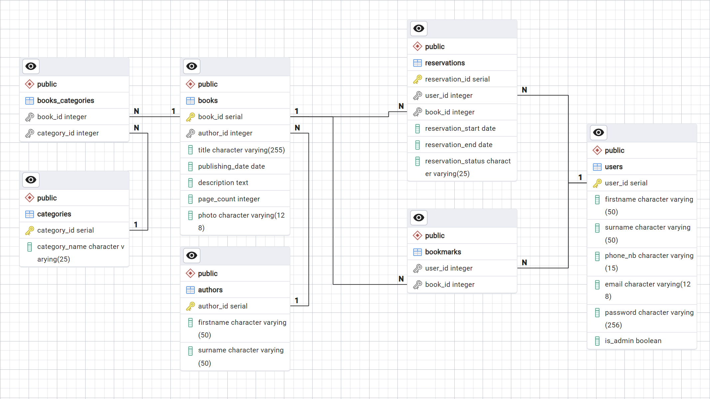
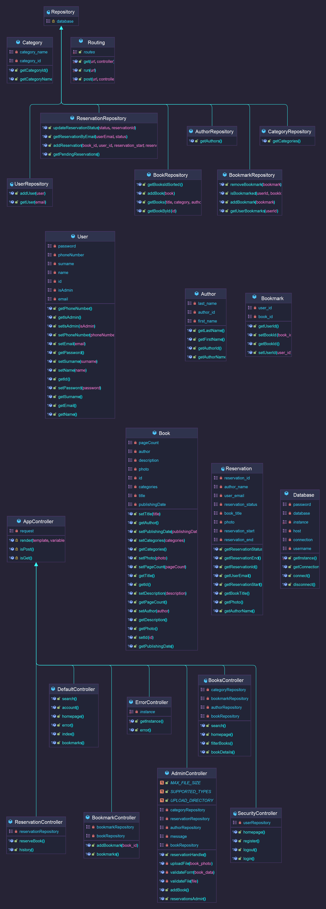
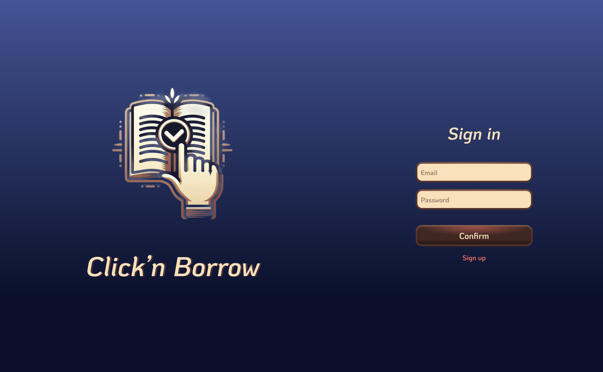
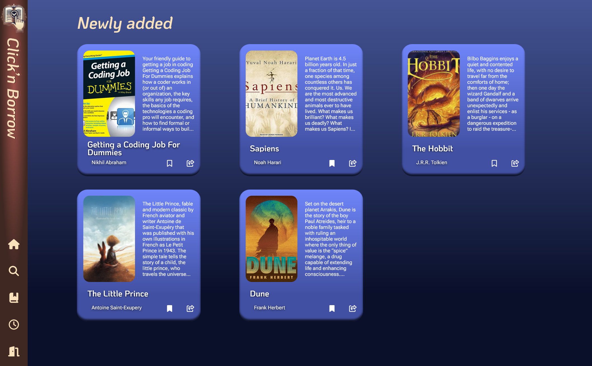
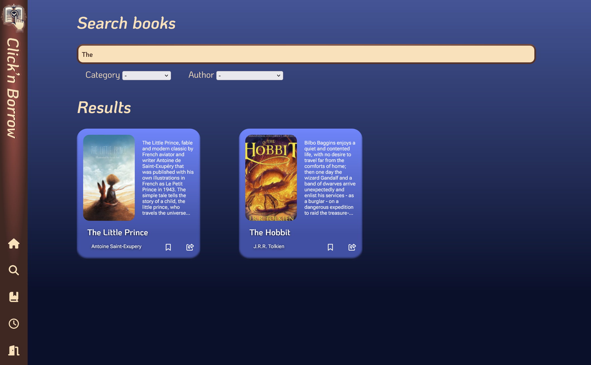
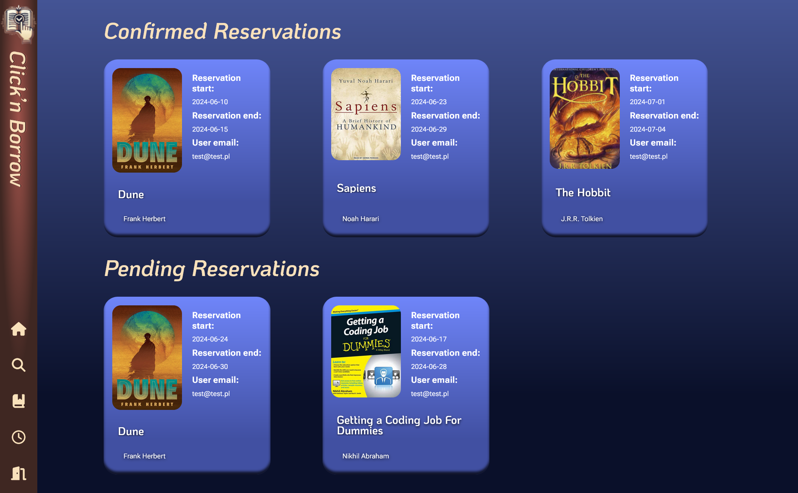
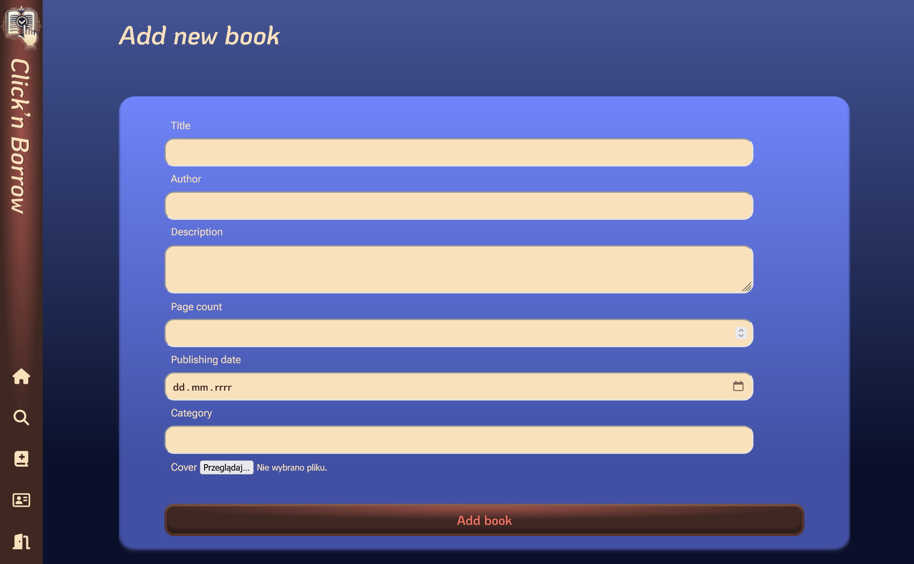
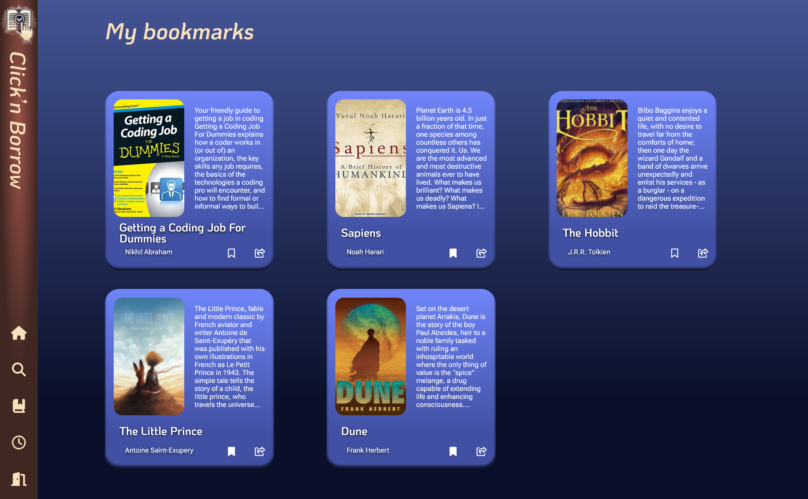

# Click'n Borrow

Click'n Borrow is a web implementation of a reservation system in a library. It allows users to browse available books, reserve them, and see their own reservations and its current status. User can also add books to the bookmarks list. Administrators can add new books to the database and manage reservations


# Table of Contents

1. [Features](#features)
2. [Technology Stack](#technology-stack)
3. [Database Design and Structure](#database-design-and-structure)
4. [UML Diagrams](#uml-diagrams)
4. [Design Patterns](#design-patterns)
5. [Installation](#installation)
6. [Screens](#screens)
7. [License](#license)


## Features

- **User Authentication:**
    - Users can create accounts, log in, and log out.
    - Passwords are hashed and securely stored in the database.

- **Book Browsing:**
    - Users can browse available books and see detailed information about each book.
    - Books can be searched by category, author, and title.

- **Book Reservation:**
    - Users can reserve books and see their current reservation status.
    - Administrators can manage reservations and change their status.

- **Bookmarks:**
    - Users can add books to the bookmarks list.
    - Users can see their bookmarks list.

- **Admin Panel:**
    - Administrators can add new books to the database.
    - Administrators can manage reservations and change their status.

- **Responsive Design:**
    - The application is fully responsive and works on all devices, including desktops, tablets, and mobile phones.

- **Data Validation:**
    - Input data is validated on the client and server sides to ensure data integrity and security.


## Technology Stack

The project is built using the following technologies:

 - **Docker** - Containerization platform
 - **PHP** - Server-side scripting language
 - **PostgreSQL** - Relational database management system
 - **HTML, CSS, JavaScript** - Front-end technologies
 - **Nginx** - Web server

## Design patterns

 -  **MVC**
 - **Singleton**
 - **Repository**

## Database Design and Structure

The project includes a comprehensive design and structure for the database, ensuring efficient data storage and retrieval. Here are the key components:

1. **Entity-Relationship Diagram (ERD):**
   - 

2. **Database Schema:**
   - [View Schema](./databasedmp.sql)


## UML Diagrams


   

## Installation

1. **Create a `config.php` file in the main directory with the following content:**
```php
<?php

define('USERNAME', 'docker');   // default username for the database
define('PASSWORD', 'docker');   // default password for the database
define('HOST', 'db');           // default host for the database
define('DATABASE', 'db');       // default database name
```

2. **Build docker container**
```
docker-compose --build
docker-compose up -d
```
3. **Use application on `localhost:8080`** 


## Screens

#### Login
| Desktop       | Mobile     |
|:-------------:|:------------:|
| | -

#### Main
| Desktop       | Mobile     |
|:-------------:|:------------:|
| | -

#### Search
| Desktop       | Mobile     |
|:-------------:|:------------:|
| | -


#### Reservation History
| Desktop       | Mobile     |
|:-------------:|:------------:|
| | -

#### Add Book
| Desktop       | Mobile     |
|:-------------:|:------------:|
| | -

### Bookmarks
| Desktop       | Mobile     |
|:-------------:|:------------:|
| | -


## License

This project is licensed under the MIT License
